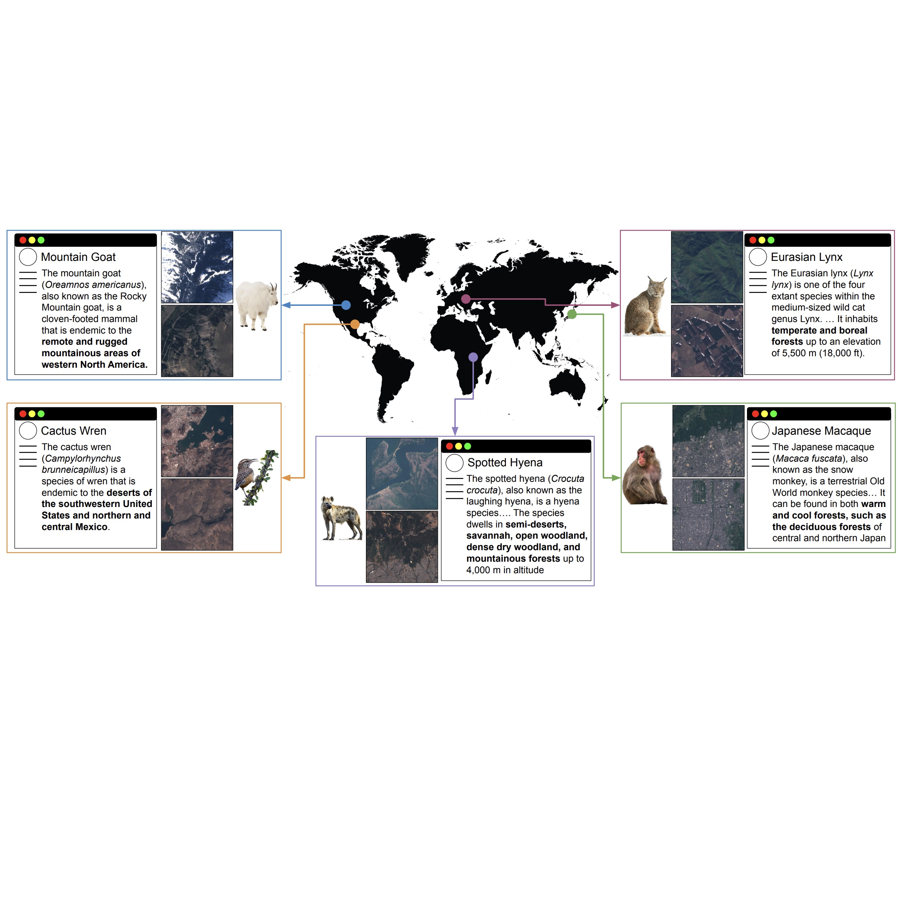
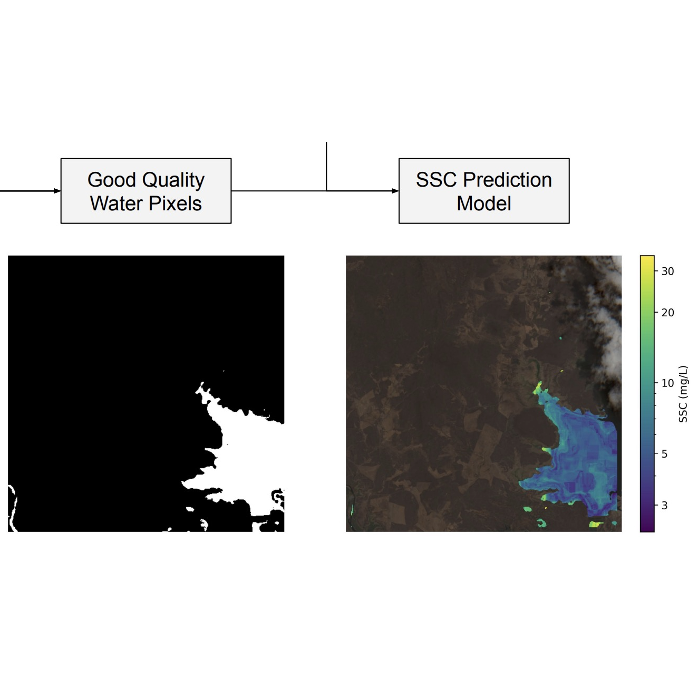
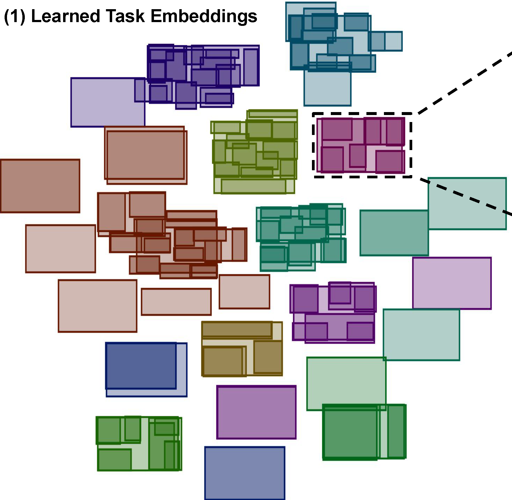
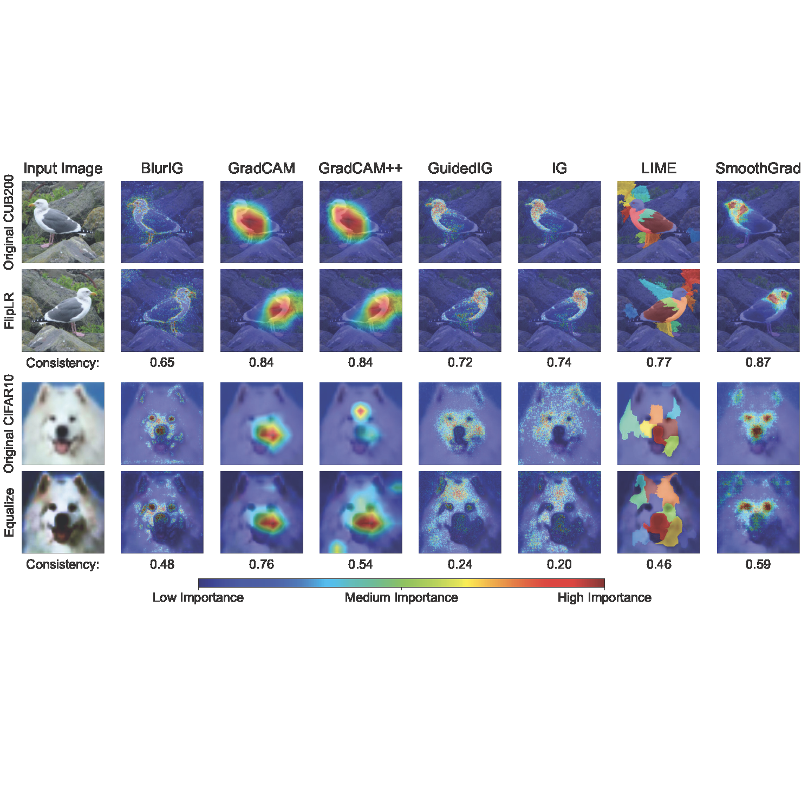
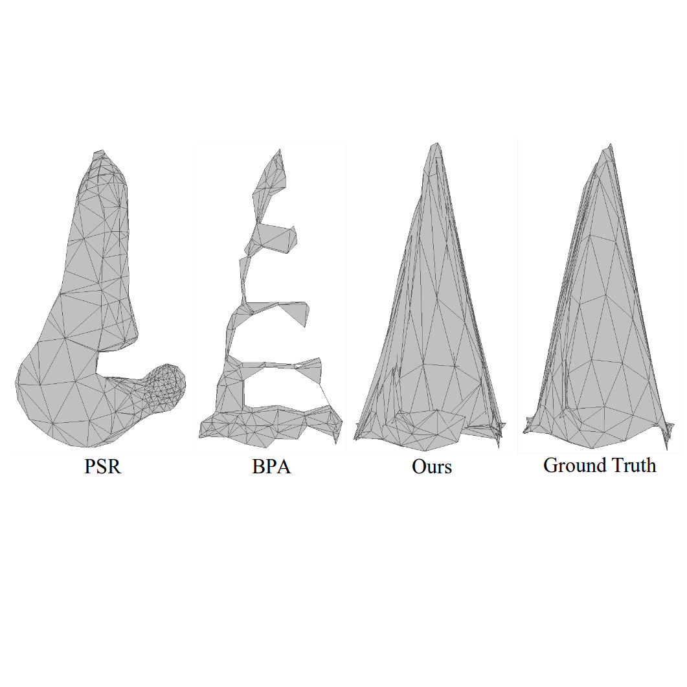

I am a PhD student in the College of Information and Computer Sciences at the University of Massachusetts Amherst, supervised by Prof. [Subhransu Maji](https://people.cs.umass.edu/~smaji/index.html) in the [Computer Vision Lab](http://vis-www.cs.umass.edu/people.html). Previously, I was a graduate research assistant at the University of the Philippines working on 3D reconstruction under the supervision of Prof. [Rowel Atienza](https://roatienza.github.io/), where I also got my master's degree in Electrical Engineering. I obtained my bachelor's degree in Electronics and Communications Engineering from the same univeristy.

My current research involves using ML and computer vision to monitor water and sediment movements in Earth's rivers using satellite images. My other research interests are explainable AI, multitask learning, understanding relationships between computer vision tasks, and applying computer vision for remote sensing applications.

# News
* **2024-05** Passed PhD Portfolio with Distinction! (Awarded to select PhD students meeting a high standard of completion, voted by faculty)
* **2024-03** [Task2Box](https://rangeldaroya.github.io/projects/task2box) paper accepted at CVPR 2024 as a Highlight (11.9% of accepted papers)!
* **2023-10** [COSE](https://rangeldaroya.github.io/projects/cose) paper presented in VIPriors at ICCV 2023
* **2022-09** Started PhD CS at University of Massachusetts Amherst
* **2020-06** [REIN](https://openaccess.thecvf.com/content_CVPRW_2020/html/w22/Daroya_REIN_Flexible_Mesh_Generation_From_Point_Clouds_CVPRW_2020_paper.html) accepted (oral presentation) at CVPR 2020 workshop
* **2018-01** Started MS Electrical Engineering at University of the Philippines

# Publications
(* means equal contribution)
<table style="width:100%;border:0px;border-spacing:0px;border-collapse:separate;margin-right:auto;margin-left:auto;"><tbody>
  
  <!-- <tr>
    <td style="padding:16px;width:20%;vertical-align:middle">
      
    </td>
    <td style="padding:8px;width:80%;vertical-align:middle">
      <strong>WildSAT: Learning Satellite Image Representations from Wildlife Observations</strong>
       
      <u>Rangel Daroya</u>, Elijah Cole, Oisin Mac Aodha, Grant Van Horn, <a href="https://people.cs.umass.edu/~smaji/">Subhransu Maji</a>
       
      <em>arXiv</em> 2024
       
      <a href="https://arxiv.org/abs/2412.14428">arXiv</a>
      

      

      We show satellite image representations can be improved using wildlife observations
      

    </td>
  </tr> -->

  <tr>
    <td style="padding:16px;width:20%;vertical-align:middle">
      
    </td>
    <td style="padding:8px;width:80%;vertical-align:middle">
      <strong>Improving Satellite Imagery Masking using Multi-task and Transfer Learning</strong>
       
      <u>Rangel Daroya</u>, <a href="https://www.luisalucchese.com/">Luisa Vieira Lucchese</a>, Travis Simmons, Punwath Prum, <a href="https://uncglobalhydrology.org/tamlin/">Tamlin Pavelsky</a>, <a href="https://www.geology.pitt.edu/people/john-gardner-phd">John Gardner</a>, <a href="https://www.umass.edu/engineering/about/directory/colin-gleason">Colin J Gleason</a>, <a href="https://people.cs.umass.edu/~smaji/">Subhransu Maji</a>
       
      <em>arXiv</em> 2024
       
      <a href="https://arxiv.org/abs/2412.08545">arXiv</a>
      

      

      We show a multi-task model for predicting water, cloud, cloud shadow, terain shadow, and snow/ice simultaneously from satellite images
      

    </td>
  </tr>

  <tr>
    <td style="padding:16px;width:20%;vertical-align:middle">
      
    </td>
    <td style="padding:8px;width:80%;vertical-align:middle">
      <strong>Task2Box: Box Embeddings for Modeling Asymmetric Task Relationships</strong>
       
      <u>Rangel Daroya</u>, <a href="https://aaronsun1030.github.io/">Aaron Sun</a>, <a href="https://people.cs.umass.edu/~smaji/">Subhransu Maji</a>
       
      <em>CVPR</em> 2024
       
      <a href="https://rangeldaroya.github.io/projects/task2box">project page</a>
      /
      <a href="https://openaccess.thecvf.com/content/CVPR2024/html/Daroya_Task2Box_Box_Embeddings_for_Modeling_Asymmetric_Task_Relationships_CVPR_2024_paper.html">CVPR24</a>
      /
      <a href="https://arxiv.org/abs/2403.17173">arXiv</a>
      

      

      We present a method for modeling asymmetric relationships between vision tasks using box embeddings
      

    </td>
  </tr>

  <tr>
    <td style="padding:16px;width:20%;vertical-align:middle">
      
    </td>
    <td style="padding:8px;width:80%;vertical-align:middle">
      <strong>COSE: A Consistency-Sensitivity Metric for Saliency on Image Classification</strong>
       
      <u>Rangel Daroya*</u>, <a href="https://aaronsun1030.github.io/">Aaron Sun*</a>, <a href="https://people.cs.umass.edu/~smaji/">Subhransu Maji</a>
       
      <em>ICCVW</em> 2023
       
      <a href="https://rangeldaroya.github.io/projects/cose">project page</a>
      /
      <a href="https://openaccess.thecvf.com/content/ICCV2023W/VIPriors/html/Daroya_COSE_A_Consistency-Sensitivity_Metric_for_Saliency_on_Image_Classification_ICCVW_2023_paper.html">ICCVW23</a>
      /
      <a href="https://arxiv.org/abs/2309.10989">arXiv</a>
      

      

      We propose metrics related to the consistency and sensitivity of saliency maps on image classification tasks to assess the performance of different explainable AI methods on a variety of models and datasets
      

    </td>
  </tr>

  <tr>
    <td style="padding:16px;width:20%;vertical-align:middle">
      
    </td>
    <td style="padding:8px;width:80%;vertical-align:middle">
      <strong>REIN: Flexible mesh generation from point clouds</strong>
       
      <u>Rangel Daroya</u>, <a href="https://roatienza.github.io/">Rowel Atienza</a>, <a href="https://eee.upd.edu.ph/about/faculty/rhandley-cajote/">Rhandley Cajote</a>
       
      <em>CVPRW</em> 2020
       
      <a href="https://openaccess.thecvf.com/content_CVPRW_2020/html/w22/Daroya_REIN_Flexible_Mesh_Generation_From_Point_Clouds_CVPRW_2020_paper.html">CVPRW20</a>
      

      

      We present a method for generating a mesh from a sparse point cloud with an arbitrary number of points
      

    </td>
  </tr>

</tbody></table>