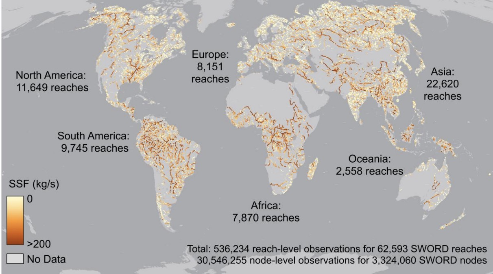
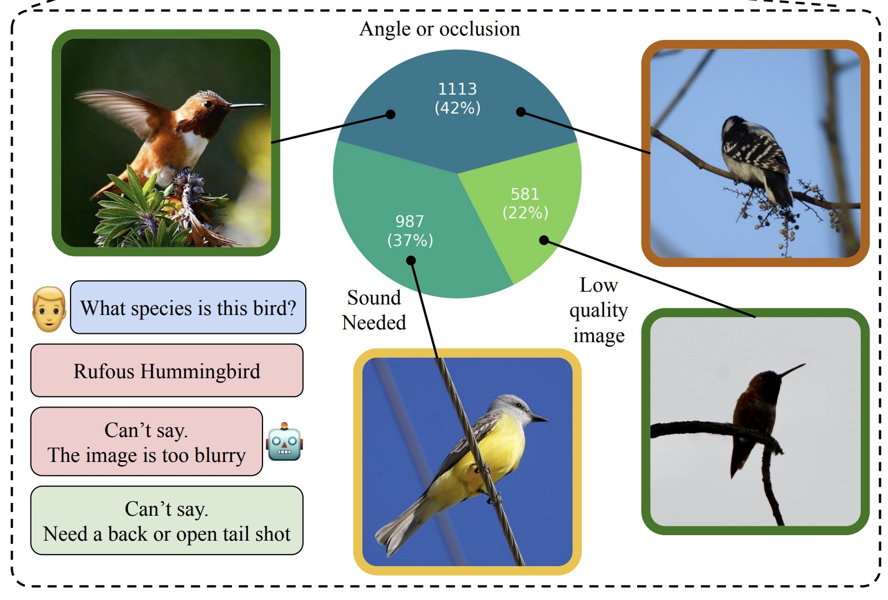
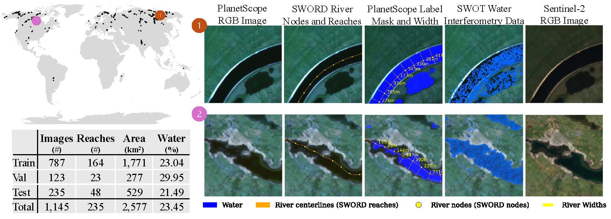
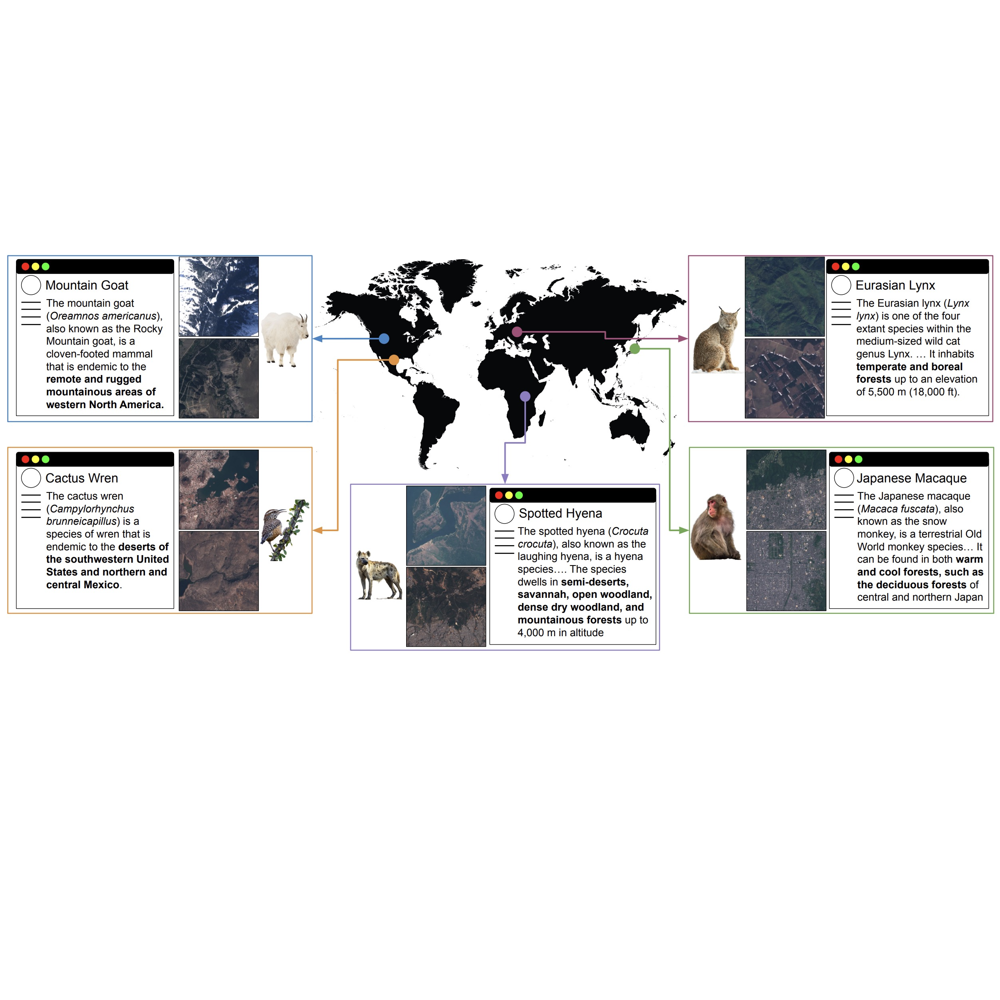
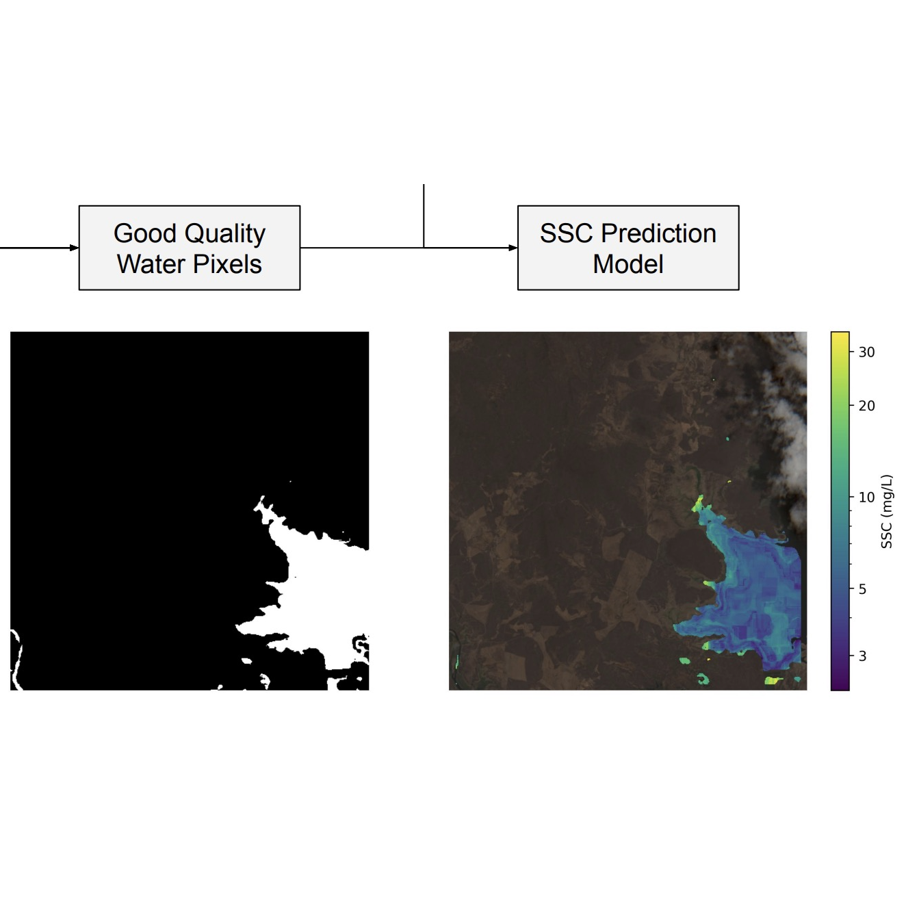
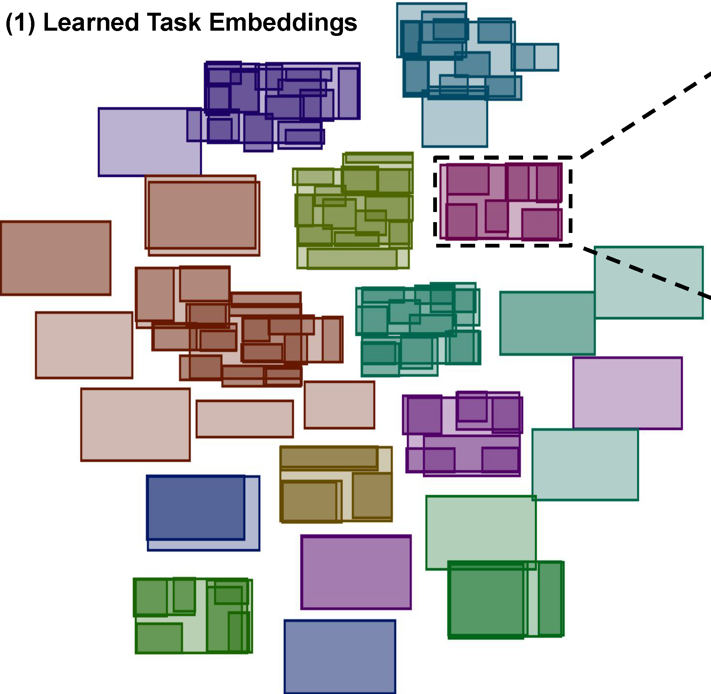
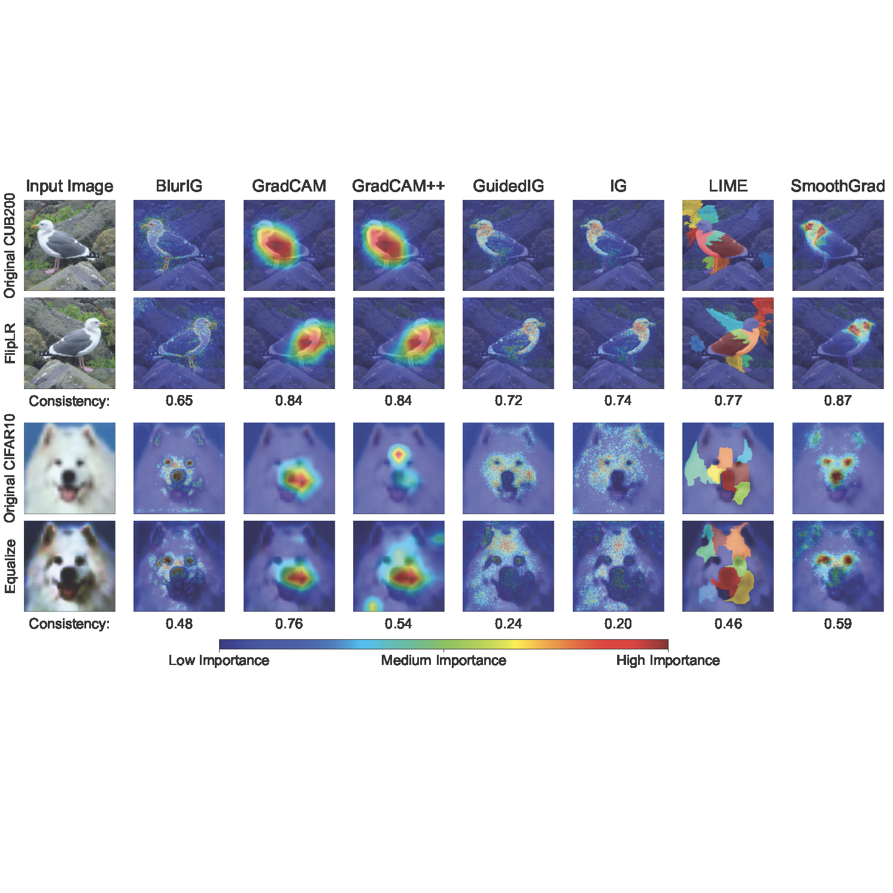
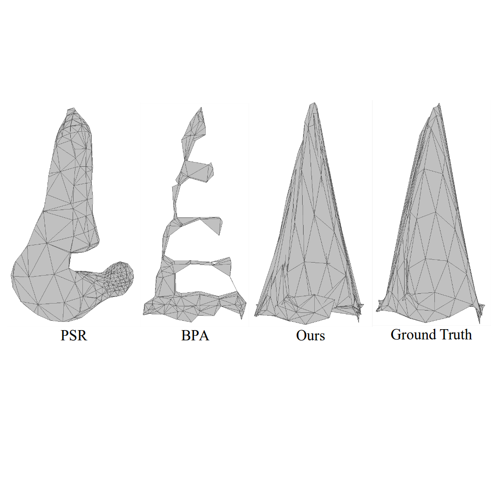

I am a PhD student in the Computer Vision Lab at UMass Amherst, advised by Prof. [Subhransu Maji](https://people.cs.umass.edu/~smaji/index.html). My research explores the relationships between computer vision tasks, with a focus on multi-task and transfer learning, and developing robust embeddings for large-scale scientific applications. My primary application domain is environmental remote sensing, where I build models to analyze multispectral satellite imagery for hydrology.

Before my PhD, I was a graduate research assistant at the University of the Philippines working on 3D reconstruction under the supervision of Prof. [Rowel Atienza](https://roatienza.github.io/), where I completed my M.S. in Electrical Engineering. I obtained my B.S. in Electronics and Communications Engineering from the same univeristy.

<!-- My current research involves using ML and computer vision to monitor water and sediment movements in Earth's rivers using satellite images. My other research interests are explainable AI, multitask learning, understanding relationships between computer vision tasks, and applying computer vision for remote sensing applications. -->

# News
* **2026-03** Our paper on [Operational near real time global riverine sediment flux estimates from space](https://d197for5662m48.cloudfront.net/documents/publicationstatus/291098/preprint_pdf/336d2cae13e1b9bdab192f857eecf917.pdf) is accepted for publication to Geophysical Research Letters
* **2026-02** [RealBirdID](https://arxiv.org/abs/2603.27033v1) accepted to CVPR 2026!
* **2026-01** Our work with NASA on monitoring rivers was featured on the UMass website [here](https://www.umass.edu/news/article/unprecedented-data-global-river-quality-quantity-now-gathered-space-powered-umass)
* **2026-01** Received the [2025 AGU Remote Sensing Student Award](https://connect.agu.org/hydrology/about/tc-committees/remote-sensing/newsletter) for RiverScope!
* **2025-12** Attending AGU'25! I’ll be giving two oral presentations on our latest work in remote sensing: [RiverScope](https://arxiv.org/abs/2509.02451) and [WildSAT](https://arxiv.org/abs/2412.14428)
* **2025-11** [SuperRivolution](https://arxiv.org/abs/2511.09597) accepted to WACV 2026!
* **2025-11** [RiverScope](https://arxiv.org/abs/2509.02451) accepted to AAAI 2026! I will also be giving an oral presentation at AAAI.
* **2025-06** [WildSAT](https://arxiv.org/abs/2412.14428) accepted to ICCV 2025! Also presenting it at the [Computer Vision for Ecology workshop](https://cv4e.netlify.app/) as a Spotlight talk
* **2025-03** Our paper on [Improving Satellite Imagery Masking using Multi-task and Transfer Learning](https://ieeexplore.ieee.org/document/10925631) has been published at IEEE JSTARS
* **2025-01** Gave a [talk](https://www.facebook.com/share/p/19sZR51KiF/) at the University of the Philippines about ["Computer Vision in the Wild"](../files/2025-01-20_UPEEEI_CV-in-the-Wild.pdf)
* **2024-05** Passed PhD Portfolio with Distinction! (Awarded to select PhD students meeting a high standard of completion, voted by faculty)
* **2024-03** [Task2Box](https://rangeldaroya.github.io/projects/task2box) paper accepted at CVPR 2024 as a Highlight (11.9% of accepted papers)!
* **2023-10** [COSE](https://rangeldaroya.github.io/projects/cose) paper presented in VIPriors at ICCV 2023
* **2022-09** Started PhD CS at University of Massachusetts Amherst
* **2020-06** [REIN](https://openaccess.thecvf.com/content_CVPRW_2020/html/w22/Daroya_REIN_Flexible_Mesh_Generation_From_Point_Clouds_CVPRW_2020_paper.html) accepted (oral presentation) at CVPR 2020 workshop
* **2018-01** Started MS Electrical Engineering at University of the Philippines

# Selected Publications
(* means equal contribution)
<table style="width:100%;border:0px;border-width:0px;border-spacing:0px;border-collapse:separate;margin-right:auto;margin-left:auto;"><tbody>

  <tr>
    <td style="border:none;padding:16px;width:20%;vertical-align:middle">
      
    </td>
    <td style="border:none;padding:8px;width:80%;vertical-align:middle">
      <strong>Operational near real time global riverine sediment flux estimates from space</strong>
       
      <a href="https://www.luisalucchese.com/">Luisa Vieira Lucchese</a>, <u>Rangel Daroya</u>, Travis T Simmons, Punwath Prum, Nikki E Tebaldi, Tamlin M Pavelsky, Subhransu Maji, John R Gardner, Colin Gleason
       
      Geophysical Research Letters 2026
       
      <a href="https://agupubs.onlinelibrary.wiley.com/doi/pdfdirect/10.1029/2025GL120407">GRL26</a>
      /
      <a href="https://d197for5662m48.cloudfront.net/documents/publicationstatus/291098/preprint_pdf/336d2cae13e1b9bdab192f857eecf917.pdf">Authorea</a>
      

      

      We present global estimates of riverine sediment flux derived from an open-source suite of algorithms using the Harmonized Landsat Sentinel (HLS) and Surface Water and Ocean Topography (SWOT) satellite products.
      

    </td>
  </tr>

  <tr>
    <td style="border:none;padding:16px;width:20%;vertical-align:middle">
      
    </td>
    <td style="border:none;padding:8px;width:80%;vertical-align:middle">
      <strong>RealBirdID: Benchmarking Bird Species Identification in the Era of MLLMs</strong>
       
      <a href="https://www.loganlawrence.info/">Logan Lawrence</a>, Mustafa Chasmai, <u>Rangel Daroya</u>, Wuao Liu, Seoyun Jeong, Aaron Sun, Max Hamilton, Fabien Delattre, Oindrila Saha, Subhransu Maji, Grant Van Horn
       
      <em>CVPR</em> 2026
       
      <a href="https://arxiv.org/abs/2603.27033v1">arXiv</a>
      

      

      We propose the RealBirdID benchmark: given an image of a bird, a system should either answer with a species or abstain with a concrete, evidence-based rationale: "requires vocalization," "low quality image," or "view obstructed".
      

    </td>
  </tr>

  <tr>
    <td style="border:none;padding:16px;width:20%;vertical-align:middle">
      
    </td>
    <td style="border:none;padding:8px;width:80%;vertical-align:middle">
      <strong>SuperRivolution: Fine-Scale Rivers from Coarse Temporal Satellite Imagery</strong>
       
      <u>Rangel Daroya</u>, <a href="https://people.cs.umass.edu/~smaji/">Subhransu Maji</a>
       
      <em>WACV</em> 2026
       
      <a href="https://openaccess.thecvf.com/content/WACV2026/html/Daroya_SuperRivolution_Fine-Scale_Rivers_from_Coarse_Temporal_Satellite_Imagery_WACV_2026_paper.html">WACV26</a>
      /
      <a href="https://arxiv.org/abs/2511.09597">arXiv</a>
      

      

      We introduce a method and an accompanying dataset that leverages multiple low-resolution satellite imagery instead of expensive high-resolution imagery for fine-scale satellite image tasks such as river width estimation.
      

    </td>
  </tr>

  <tr>
    <td style="border:none;padding:16px;width:20%;vertical-align:middle">
      
    </td>
    <td style="border:none;padding:8px;width:80%;vertical-align:middle">
      <strong>RiverScope: High-Resolution River Masking Dataset</strong>
       
      <u>Rangel Daroya</u>, Taylor Rowley, Jonathan Flores, Elisa Friedmann, Fiona Bennitt, Heejin An, Travis Simmons, Marissa Jean Hughes, Camryn L Kluetmeier, Solomon Kica, J Daniel Vélez, Sarah E Esenther, Thomas E Howard, Yanqi Ye, Audrey Turcotte, Colin Gleason, <a href="https://people.cs.umass.edu/~smaji/">Subhransu Maji</a>
       
      <em>AAAI</em> 2026, AI for Social Impact (Oral Presentation)
       
      <em>AGU</em> 2025 (Remote Sensing Student Award)
       
      <a href="https://ojs.aaai.org/index.php/AAAI/article/view/41175">AAAI26</a>
      /
      <a href="https://arxiv.org/abs/2509.02451">arXiv</a>
      

      

      We introduce a high-resolution river segmentation dataset that can be used for precise hydrology tasks such as river segmentation and river width estimation.
      

    </td>
  </tr>
  
  <tr>
    <td style="border:none;padding:16px;width:20%;vertical-align:middle">
      
    </td>
    <td style="border:none;padding:8px;width:80%;vertical-align:middle">
      <strong>WildSAT: Learning Satellite Image Representations from Wildlife Observations</strong>
       
      <u>Rangel Daroya</u>, <a href="https://elijahcole.me/">Elijah Cole</a>, <a href="https://homepages.inf.ed.ac.uk/omacaod/">Oisin Mac Aodha</a>, <a href="https://gvh.codes/">Grant Van Horn</a>, <a href="https://people.cs.umass.edu/~smaji/">Subhransu Maji</a>
       
      <em>ICCV</em> 2025 
       
      <em>CV4Ecology Workshop</em> @ ICCV 2025 (Spotlight Talk)
       
      <a href="https://openaccess.thecvf.com/content/ICCV2025/html/Daroya_WildSAT_Learning_Satellite_Image_Representations_from_Wildlife_Observations_ICCV_2025_paper.html">ICCV25</a>
      /
      <a href="https://arxiv.org/abs/2412.14428">arXiv</a>
      

      

      We show satellite image representations can be improved using wildlife observations due to information we can get from wildlife habitats
      

    </td>
  </tr>

  <tr>
    <td style="border:none;padding:16px;width:20%;vertical-align:middle">
      
    </td>
    <td style="border:none;padding:8px;width:80%;vertical-align:middle">
      <strong>Improving Satellite Imagery Masking using Multi-task and Transfer Learning</strong>
       
      <u>Rangel Daroya</u>, <a href="https://www.luisalucchese.com/">Luisa Vieira Lucchese</a>, Travis Simmons, Punwath Prum, <a href="https://uncglobalhydrology.org/tamlin/">Tamlin Pavelsky</a>, <a href="https://www.geology.pitt.edu/people/john-gardner-phd">John Gardner</a>, <a href="https://www.umass.edu/engineering/about/directory/colin-gleason">Colin J Gleason</a>, <a href="https://people.cs.umass.edu/~smaji/">Subhransu Maji</a>
       
      <em>IEEE Journal of Selected Topics in Applied Earth Observations and Remote Sensing</em> 2025
       
      <a href="https://ieeexplore.ieee.org/document/10925631">JSTARS25</a>
      /
      <a href="https://arxiv.org/abs/2412.08545">arXiv</a>
      

      

      We show a multi-task model for predicting water, cloud, cloud shadow, terain shadow, and snow/ice simultaneously from satellite images.
      

    </td>
  </tr>

  <tr>
    <td style="border:none;padding:16px;width:20%;vertical-align:middle">
      
    </td>
    <td style="border:none;padding:8px;width:80%;vertical-align:middle">
      <strong>Task2Box: Box Embeddings for Modeling Asymmetric Task Relationships</strong>
       
      <u>Rangel Daroya</u>, <a href="https://aaronsun1030.github.io/">Aaron Sun</a>, <a href="https://people.cs.umass.edu/~smaji/">Subhransu Maji</a>
       
      <em>CVPR</em> 2024 (Highlight: 11.9% of accepted papers)
       
      <a href="https://rangeldaroya.github.io/projects/task2box">project page</a>
      /
      <a href="https://openaccess.thecvf.com/content/CVPR2024/html/Daroya_Task2Box_Box_Embeddings_for_Modeling_Asymmetric_Task_Relationships_CVPR_2024_paper.html">CVPR24</a>
      /
      <a href="https://arxiv.org/abs/2403.17173">arXiv</a>
      

      

      We present a method for modeling asymmetric relationships between vision tasks using box embeddings.
      

    </td>
  </tr>

  <tr>
    <td style="border:none;padding:16px;width:20%;vertical-align:middle">
      
    </td>
    <td style="border:none;padding:8px;width:80%;vertical-align:middle">
      <strong>COSE: A Consistency-Sensitivity Metric for Saliency on Image Classification</strong>
       
      <u>Rangel Daroya*</u>, <a href="https://aaronsun1030.github.io/">Aaron Sun*</a>, <a href="https://people.cs.umass.edu/~smaji/">Subhransu Maji</a>
       
      <em>ICCVW</em> 2023
       
      <a href="https://rangeldaroya.github.io/projects/cose">project page</a>
      /
      <a href="https://openaccess.thecvf.com/content/ICCV2023W/VIPriors/html/Daroya_COSE_A_Consistency-Sensitivity_Metric_for_Saliency_on_Image_Classification_ICCVW_2023_paper.html">ICCVW23</a>
      /
      <a href="https://arxiv.org/abs/2309.10989">arXiv</a>
      

      

      We propose metrics related to the consistency and sensitivity of saliency maps on image classification tasks to assess the performance of different explainable AI methods on a variety of models and datasets
      

    </td>
  </tr>

  <tr>
    <td style="border:none;padding:16px;width:20%;vertical-align:middle">
      
    </td>
    <td style="border:none;padding:8px;width:80%;vertical-align:middle">
      <strong>REIN: Flexible mesh generation from point clouds</strong>
       
      <u>Rangel Daroya</u>, <a href="https://roatienza.github.io/">Rowel Atienza</a>, <a href="https://eee.upd.edu.ph/about/faculty/rhandley-cajote/">Rhandley Cajote</a>
       
      <em>CVPRW</em> 2020
       
      <a href="https://openaccess.thecvf.com/content_CVPRW_2020/html/w22/Daroya_REIN_Flexible_Mesh_Generation_From_Point_Clouds_CVPRW_2020_paper.html">CVPRW20</a>
      

      

      We present a method for generating a mesh from a sparse point cloud with an arbitrary number of points
      

    </td>
  </tr>

</tbody></table>
